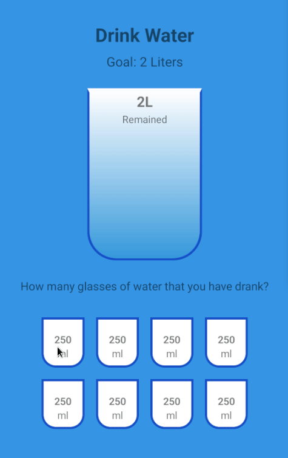

## Description:
An IOS and Android app that helps user to keep drinking water.

## Starting Project:
1. Cloning the repository
-  `git clone git@github.com:Vincenzofdg/DrinkUP.git`
2. Enter in the directory folder
- `cd DrinkUP`
3. Install projects dependencies
- `npm install` or `npm ci`
4. Starting localy
- Node Version 18: `npm start`

 

changing the name or the package name of my application

npm install react-native-rename

changing version 

npm install react-native-version

npx react-native-version --never-amend